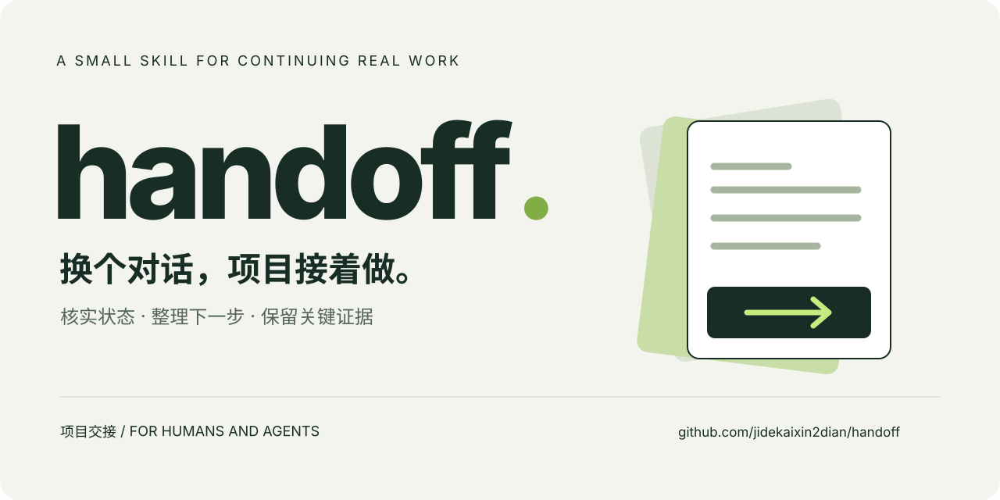
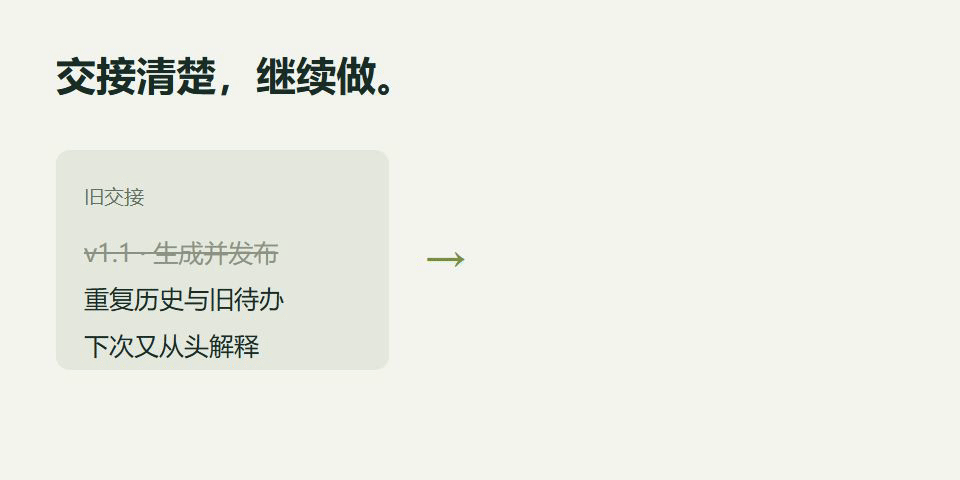

[中文](README.md) · [Example](docs/example.md) · [Validation notes](docs/validation.md)

# handoff

**Help the next person or agent understand where a project stands and what comes next.**

Long projects accumulate repeated handoffs, stale versions, and old task lists. `handoff` is a small, instruction-only skill that verifies the workspace state, prepares a concise current entry point, and links to the evidence needed for the next task.

## Start with Codex

Install into the current project using the [skills CLI](https://github.com/vercel-labs/skills):

```bash
npx skills add jidekaixin2dian/handoff --skill handoff --agent codex
```

Then invoke it in a Codex environment that supports `$skill-name`:

```text
$handoff I want to continue this project in a new conversation.
Verify its current state, refresh the handoff entry point,
and preserve the evidence, constraints, and next action.
```

You can also ask `$skill-installer` to install from `https://github.com/jidekaixin2dian/handoff/tree/main/skills/handoff`, or copy the `skills/handoff` directory into a project or user `.agents/skills/` location. Inspect existing skills before overwriting them. See [OpenAI's skill documentation](https://learn.chatgpt.com/docs/build-skills) for discovery and invocation details.

## A useful handoff answers four questions

| Current state | Next action | Constraints | Evidence |
| --- | --- | --- | --- |
| Which version and findings are current? | What is unfinished or needs a human decision? | What must the successor preserve? | Where is the canonical material for this task? |

Keep historical instructions separate from current tasks. An offline check does not establish human acceptance, and an old release plan does not authorize a new publication.

## See the workflow



This illustration and the video use a fictional project. They explain the workflow; they are not recordings of an automatic model execution.

[36-second introduction](https://raw.githubusercontent.com/jidekaixin2dian/handoff/main/assets/handoff-intro.mp4) · [Before and after](docs/example.md)

## Keep the boundaries

Preserve raw data, frozen evaluations, human ratings, hashes, unique decisions, and existing user changes, including untracked files. Only consider repository cleanup when requested; a file being downloadable again does not establish that it can be removed safely.

This is a standalone skill package, not a listed plugin. It does not automatically manage conversations, commit, publish, send messages, optimize application RAM, or clean an entire computer.

## Evidence and feedback

Validation includes format checks, static review of twelve scenarios, one manual isolated file exercise, and public installation checks. See [the validation notes](docs/validation.md) for evidence and limits. Cross-model behavior and token savings have not been measured. The package follows `SKILL.md` conventions; behavior in other clients has not been individually tested.

For feedback, [open an issue](https://github.com/jidekaixin2dian/handoff/issues/new) with the request, observed behavior, and expected behavior. Remove credentials and private material before sharing.

[Skill source](skills/handoff/SKILL.md) · [MIT License](LICENSE) · jidekaixin2dian
