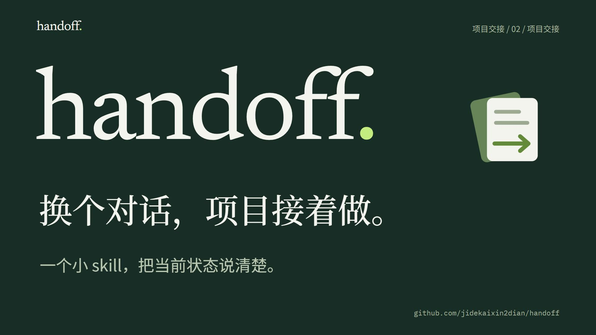

[](https://raw.githubusercontent.com/jidekaixin2dian/handoff/main/assets/handoff-intro.mp4)

[English](README.en.md) · [快速开始](#快速开始) · [交接示例](docs/example.md) · [宣传素材](#宣传素材)

# handoff · 项目交接

**换个对话，项目接着做。**

用 AI 做长任务，换个新对话时，往往要重新解释项目：哪个版本有效？哪些事已经做完？接下来做什么？

`handoff` 是一个轻量的项目交接 skill。先核实工作区的当前状态，再整理状态、下一步、关键约束和证据入口，让下一位 Agent 或同事知道从哪里接着做。纯指令，MIT 开源，不需要额外部署服务。

[观看 / 下载 36 秒介绍视频](https://raw.githubusercontent.com/jidekaixin2dian/handoff/main/assets/handoff-intro.mp4)

## 快速开始

使用 [skills CLI](https://github.com/vercel-labs/skills) 安装到当前项目的 Codex：

```bash
npx skills add jidekaixin2dian/handoff --skill handoff --agent codex
```

然后在支持 `$skill-name` 调用方式的 Codex 中发送：

```text
$handoff 我要换个新对话继续这个项目。
请核实当前状态，更新交接入口，保留关键证据和下一步。
```

<details>
<summary>用 skill-installer 或手动安装</summary>

```text
$skill-installer 从 https://github.com/jidekaixin2dian/handoff/tree/main/skills/handoff 安装 handoff。
```

也可以复制 [`skills/handoff`](skills/handoff/SKILL.md) 目录到项目的 `.agents/skills/handoff/`，或用户目录的 `.agents/skills/handoff/`。已有同名技能时，先核对现有内容，避免覆盖。具体目录与调用方式见 [OpenAI 文档](https://learn.chatgpt.com/docs/build-skills)。

</details>

## 接手时，四件事说清楚

| 当前状态 | 下一步 | 关键约束 | 证据入口 |
| --- | --- | --- | --- |
| 哪个版本有效，哪些结果已验证 | 什么尚未完成，什么需要人决定 | 哪些数据、接口和历史材料要保留 | 按任务链接到权威文件，细节按需展开 |

它不会把“离线检查通过”写成“人工已经接受”，也不会把旧交接里的发布计划当作新的授权。

## 看一眼流程


完整例子见 [交接前后](docs/example.md)。

## 适合这些时候

- 要换一个新对话，继续长任务。
- 交接文档越写越长，需要去重并保留原始证据。
- Agent 或同事接手，希望快速找到当前状态和下一步。
- 明确要求整理项目文件，希望先核实引用、可再生性和独有内容。

只想检查而不改文件，也可以直接说：

```text
$handoff 只读审查当前交接，指出过期状态、断链和遗漏，不修改文件。
```

## 保留边界，才接得稳

原始数据、冻结评估、人工评分、哈希、独有决策和已有用户修改都要保留。没有清理请求，就不会顺手删除文件；“还能重新下载”也不是充分的删除理由。

## 宣传素材

- [介绍视频](https://raw.githubusercontent.com/jidekaixin2dian/handoff/main/assets/handoff-intro.mp4)：36 秒，1080p，30 fps；衬线标题与原创电钢琴配乐。
- [视频源文件 ZIP](downloads/handoff-video-source.zip)：Remotion 项目、字体与配乐文件，可本地预览和修改。
- [抖音、B站、掘金发布文案](docs/launch.md)：各平台标题、简介或正文，以及安装入口。
- [视频封面](assets/video-preview.jpg) · [项目分享图](assets/social-card.png) · [流程 GIF](assets/workflow.gif)。

## 验证与反馈

已完成格式检查、12 类场景静态审查、隔离文件演练和公开下载安装验证。证据与实际限制见 [检查记录](docs/validation.md)。尚未进行跨模型评测或 token 节省测量。

遇到不合适的交接行为，欢迎 [提交 Issue](https://github.com/jidekaixin2dian/handoff/issues/new)：说明请求、实际结果和预期结果，删去凭据、私有资料及个人路径后再分享。

[技能源码](skills/handoff/SKILL.md) · [MIT License](LICENSE) · jidekaixin2dian
